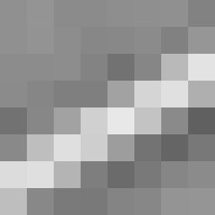
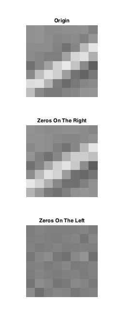
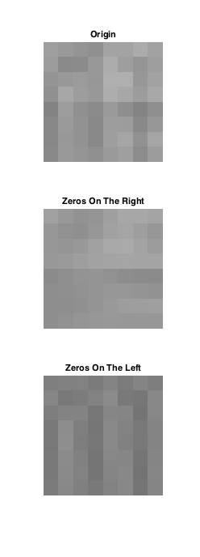
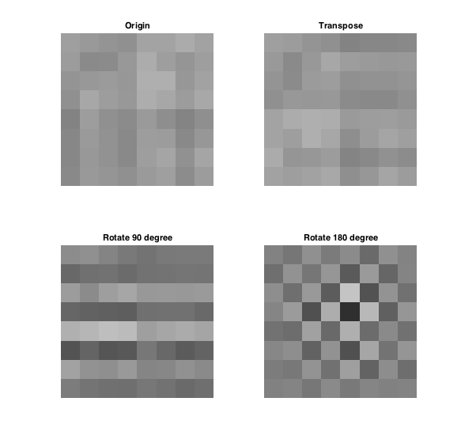
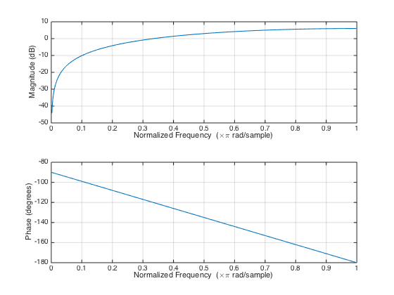
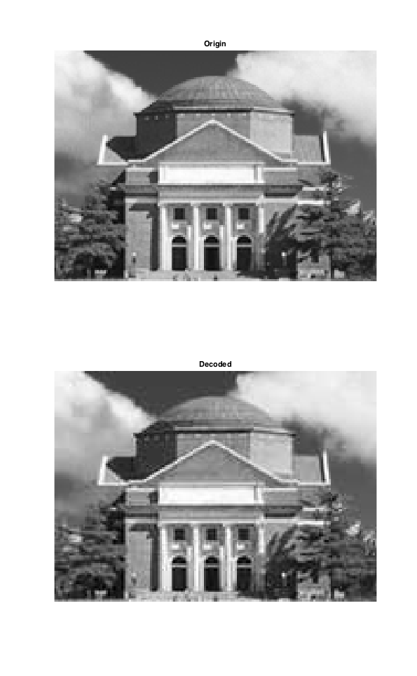
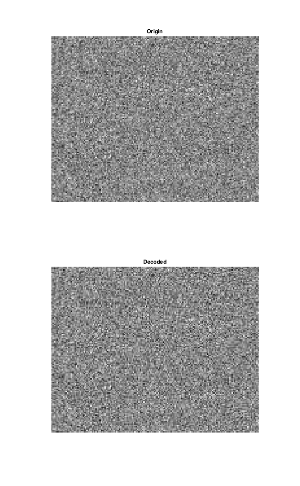
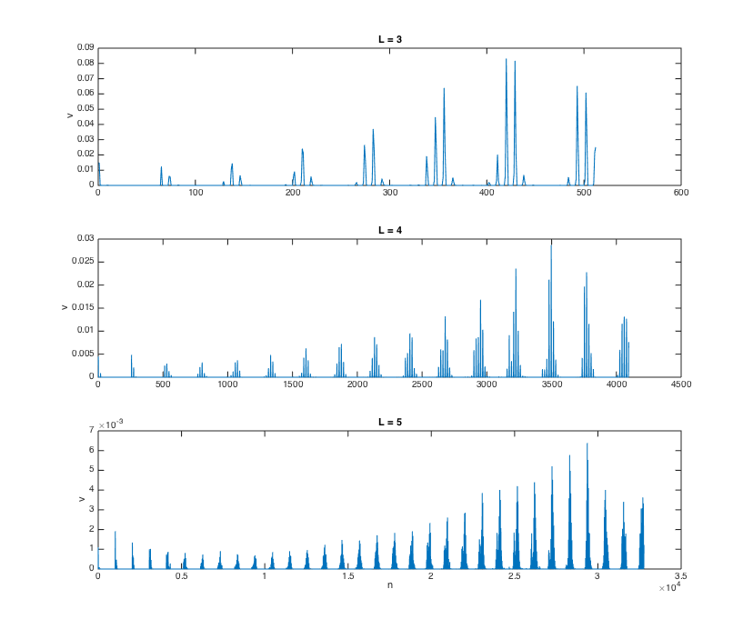

# 图像处理综合实验

* 无 36
* 李思涵
* 2013011187

## 原创性声明

此实验的代码 & 实验报告均为原创。


## 第一章 基础知识

### 1.1 了解图形工具箱

### 1.2 练习 Image file I/O 函数

在进行练习之前，我们先导入测试图像：

```matlab
load resource/hall
```

我们可以得到 `hall_color` 和 `hall_gray` 两个变量，其中测试图像是 `hall_color`。

#### 1.2a 画红圆

要画红圆，我们只需要先将测试图像复制一份，然后将圆圈内的点颜色全部置为 #FF0000 即可。代码如下： 

```matlab
%% add_circle: Add a red circle to the center of the given image
function circled_img = add_circle(img)
    circled_img = img;  % Copy the image.

    [y_max, x_max, ~] = size(circled_img);
    r = min(x_max, y_max) / 2;
    center = [(x_max + 1) / 2, (y_max + 1) / 2];

    for y = 1:y_max
        for x = 1:x_max
            if norm([x y] - center) <= r
                circled_img(y, x, :) = [255 0 0];
            end
        end
    end
```

调用函数并保存图像：

```matlab
imwrite(add_circle(hall_color), '../../report/hall_circal.bmp');
```

得到图像如下：


#### 1.2b 黑白格涂色

为了将测试图像涂成国际象棋“黑白格”的样子，我们只需要对所有像素进行迭代，并计算出每块像素所属的格子。若为黑格子，我们只需将该位置改为黑色即可。具体代码如下：

```matlab
%% add_chess_board_mask: Add a mask like a chess board to a image
function masked_img = add_chess_board_mask(img)
    masked_img = img;  % Copy the image.

    [y_max, x_max, ~] = size(img);

    for y = 1:y_max
        for x = 1:x_max
            if mod(ceil(x / x_max * 8) + ceil(y / y_max * 8), 2) == 0
                masked_img(y, x, :) = [0 0 0];
            end
        end
    end
```

调用函数并保存图像：

```matlab
imwrite(add_chess_borad_mask(hall_color), '../../report/hall_chess_borad.bmp');
```

得到图像如下：


可以看到，以上两个图都达到了目标。

## 第二章 图像压缩编码

### 2.1 在变换域中实现预处理

由于变换域中的第一个分量便是直流分量，所以很明显这一步骤可以在变换域中进行。具体来说，由于 N = 8 时二维 DCT 变换的 DC 基底为 1/8，故只需要将 DC 分量减去 `128 / (1/8) = 1024` 即可。

需要注意的是，由于原矩阵元素类型为 `uint8`，故将其减去 128 前应将其转换成足够大的有符号数，例如 `int16`。

我们使用 `hall_gray` 的其中一块进行验证：



```matlab
block = hall_gray(41:48, 65:72);
c = dct2(block);
c(1) = c(1) - 1024;  % Decimate DC component.

norm(c - dct2(int16(block) - 128))  % Compare two methods.
% ans =
%
%    2.1047e-13
```

可以看到，两种方法得到的变换域矩阵几乎完全相同。产生的一些误差可能来自于计算中的舍入误差。

### 2.2 实现二维 DCT

由公式 `C = D * P * DT` 可知，进行二维 DCT 的关键在于构造 DCT 算子 D。为此我们先定义函数 `trans_mat`：

```matlab
%% trans_mat: Construct NxN DCT transform matrix
function D = trans_mat(N)
    D = sqrt(2 / N) * cos([0:N-1]' * [1:2:2*N-1] * pi / (2 * N));
    D(1, :) = sqrt(1 / N);
```

然后我们便可以轻松进行二维 DCT 变换了：

```matlab
%% my_dct2: My implementation of dct2
function B = my_dct2(A)
    % DCT transform matrix.
    [row, col] = size(A);
    B = trans_mat(row) * double(A) * trans_mat(col)';
```

和内置函数 `dct2` 进行比较：

```matlab
norm(my_dct2(block) - dct2(block))
% ans =
%
%    7.9534e-13
```

可以看到误差极小，说明我们实现的二维 DCT 变换是正确的。

### 2.3 改变 DCT 系数

我们先来看一下 8x8 DCT 的基底：


可以发现，相对于前四列，右侧四列基底在横向上都有较高频变化。故若将右四列置为 0，恢复出的图像应在横向上没有高频分量。反之，若将左四列置为 0，则恢复出的图像在横向上应没有低频分量。

我们先对原来的 block 和 `hall_gray(17:24, 81:88)` 进行验证：

```matlab
c_right_zero = c;
c_left_zero = c;
c_right_zero(:, 5:8) = 0;
c_left_zero(:, 1:4) = 0;

subplot 311
imshow(block)
title Origin

subplot 312
imshow(uint8(idct2(c_right_zero) + 128))
title 'Zeros On The Right'

subplot 313
imshow(uint8(idct2(c_left_zero) + 128))
title 'Zeros On The Left'
```




可以看到，横向上的低频分量和高频分量被分离到了中下两幅图中，和我们的理论分析一致。

### 2.4 转置/旋转 DCT 系数

若对 DCT 系数转置，则横向与纵向分量系数互换，故恢复出的图像同样发生转置。

若将 DCT 系数旋转 90°，则大部分能量会转移到左下角，即纵向高频横向低频。

同样，若旋转 180°，则大部分能量会转移到右下角，即双向高频。

实际效果如下所示：

```matlab
subplot 221
imshow(uint8(idct2(c) + 128))
title Origin

subplot 222
imshow(uint8(idct2(c') + 128))
title Transpose

subplot 223
imshow(uint8(idct2(rot90(c)) + 128))
title 'Rotate 90 degree'

subplot 224
imshow(uint8(idct2(rot90(rot90(c))) + 128))
title 'Rotate 180 degree'
```


和我们的理论分析一致。令人不解的是，左下图与右上图，左上图与右下图看起来竟然有些许相似。让我们看看换另一块的看看处理结果：



仍然和我们的理论分析一致，但相似性几乎消失了。之前的相似性可能是由频谱的巧妙分布，导致旋转后仍会形成条带，所以看起来和原图有些相似。

### 2.5

不考虑初值，差分编码系统的差分方程为：

    cD^(n) = -cD~(n) + cD~(n - 1)

即 `A = 1, B = [-1 1]`

使用 `freqz` 画出频率响应：

```matlab
freqz([-1 1], 1);
```



可以看出，这是一个高通系统。这说明 DC 系数的低频频率分量更多，故经过高通系统后能量会有很大的衰减，从而达到信息压缩的目的。

### 2.6 DC 预测误差与 Category 的关系

从表中不难观察出，Category 的值即为预测误差所对应的 Magnitude 二进制表示的长度。具体关系为：

    Category = ceil(log2(|error| + 1))
### 2.8 分块，DCT & 量化

为了实现分块，DCT 和量化，我们编写了 `preprocess` 函数。其中具体完成的操作如下：

首先，为了之后的矩阵计算，我们先将传入的图像 `img` 转换为 `double`，同时将每个元素减去 128。

```matlab
img = double(img) - 128;  % Convert to double for matrix ops later.
```

然后，分块前我们确保图像的尺寸是 8 的倍数，若不是则用右下方元素填充。这一点可以用 `padarray` 轻松做到：

```matlab
% Ensure row/col is a multiple of 8.
origin_size = size(img);
new_size = ceil(origin_size / 8) * 8;
left = new_size - origin_size;
img = padarray(img, left, 'replicate', 'post');
```

然后我们便可以遍历所有块，对每个块进行 DCT ，量化和 Zig-Zag 遍历：

```matlab
out = zeros(64, numel(img) / 64);  % Placeholder for the output.

% Scanning blocks.
k = 1;
for row = 1:8:new_size(1)
    for col = 1:8:new_size(2)
        c = dct2(img(row:row+7, col:col+7));  % DCT.
        c = round(c ./ QTAB);                 % Quantize.
        out(:, k) = c(zigzag(8));             % Zig-Zag.
        k = k + 1;
    end
end
```

### 2.9 实现 JPEG 编码

我们刚刚实现的 `preprocess` 函数已经实现了分块，DCT 和量化的工作。所以为了完成 JPEG 编码工作，我们还需要计算 DC 系数流和 AC 系数流。

我们先来定义几个辅助函数：

`diff_encode`: 计算差分编码：

```matlab
%% diff_encode: Encode using differential coding.
function Y = diff_encode(X)
    Y = [0 X] - [X 0];  % X(n - 1) - X(n).
    Y = [X(1), Y(2:end-1)];
end
```

`amp2cate`: 根据幅度计算 Huffman 表中所属类别：

```matlab
%% amp2cate: Convert amp to category
function cate = amp2cate(amp)
    cate = ceil(log2(abs(amp) + 1));
```

`dec2_1s`: 将十进制转化为 1-补码

```matlab
%% dec2_1s: Convert decimal to 1's complement
function y = dec2_1s(dec)
    y = dec2bin(abs(dec)) - '0';
    if dec < 0
        y = 1 - y;  % Use 1's complement.
    end
```

然后我们便可以开始实现具体的编码函数了。

对于 DC 系数，我们先对其进行差分编码，然后依次对每个预测误差进行编码，形成码流。需要注意的是，对于 Category 为 0 的预测误差，其取值只有可能是 0，故不需要编码其 Magnitude。具体代码实现如下：

```matlab
%% encode_dc: Encode DC component
function DC_stream = encode_dc(DC, DCTAB)
    errors = diff_encode(DC);
    category = amp2cate(errors);

    DC_stream = [];

    for k = 1:length(errors)
        e = errors(k);
        row = category(k) + 1;

        huff = DCTAB(row, 2:1+DCTAB(row, 1));
        if e == 0
            DC_stream = [DC_stream huff];
        else
            DC_stream = [DC_stream huff dec2_1s(e)];
        end
    end

    DC_stream = DC_stream';
end
```

让我们用 例2.2 的样例测试一下：

```matlab
num2str(encode_dc([10, 8, 60], DCTAB)')
% ans =
%
% 1  0  1  1  0  1  0  0  1  1  1  0  1  1  1  0  0  0  1  0  1  1
```

结果与例题答案一致。

紧接着，我们对 AC 系数进行编码。我们依次对每一列进行处理，对每一列做如下操作：

1. 找到第一个非零元素，若没有且仍有数据说明该列末尾有 0，加入 EOB 标记后处理下一块；
2. 若 run 大于 15 则加入 ZRL，直到 run 小余等于 15；
3. 对 amp 进行编码，加入码流；
4. 去除这列中已处理的元素，返回步骤 1。

具体代码实现如下：

```matlab
%% encode_ac: Encode AC component
function AC_stream = encode_ac(AC, ACTAB)
    AC_stream = [];

    for k = 1:size(AC, 2)  % For every block.
        col = AC(:, k);

        amp_index = find(col, 1);  % Find first non-zero.
        while numel(amp_index)
            amp = col(amp_index);
            Run = amp_index - 1;

            % Reduce zeros.
            while Run > 15
                AC_stream = [AC_stream 1 1 1 1 1 1 1 1 0 0 1];
                Run = Run - 16;
            end

            % Encode run/size
            Size = amp2cate(amp);
            row = Run * 10 + Size;
            huff = ACTAB(row, 4:3+ACTAB(row, 3));

            AC_stream = [AC_stream huff dec2_1s(amp)];  % Add to stream.

            col(1:amp_index) = [];  % Delete this run/amp.
            amp_index = find(col, 1);  % Find next non-zero.
        end
        if length(col)  % Zero(s) not coded, insert EOB
            AC_stream = [AC_stream 1 0 1 0];
        end
    end

    AC_stream = AC_stream';
```

我们使用 例2.3 中数据进行检验：

```matlab
AC = [10 3 0 0 2 zeros(1, 20) 1 zeros(1, 37)]';
num2str(encode_ac(AC, ACTAB)')
% ans =
%
% 1  0  1  1  1  0  1  0  0  1  1  1  1  1  1  1  1  0  0  0  1  0  ...
% 1  1  1  1  1  1  1  1  0  0  1  1  1  1  0  1  1  1  1  0  1  0
```

结果也与样例一致。于是我们编写顶层函数调用预处理函数和编码函数：

```matlab
%% jpeg_encode: Encode an image using JPEG.
function [DC_stream, AC_stream, height, width] = jpeg_encode(img)
    load ../../resource/JpegCoeff

    [height, width] = size(img);  % Save the origin size.
    coefficients = preprocess(img, QTAB);

    DC_stream = encode_dc(coefficients(1, :), DCTAB);
    AC_stream = encode_ac(coefficients(2:end, :), ACTAB);
end
```

对 hall_gray 进行处理，并将结果保存在 `jpegcodes.mat` 中：

```matlab
[DC_stream, AC_stream, height, width] = jpeg_encode(hall_gray);
save jpegcodes DC_stream AC_stream height width
```

### 2.10 计算压缩比

由于输入的图像每个像素为 8 比特（`uint8`），输出的 AC, DC 码流每个元素为 1 比特，假设高度与宽度各使用 4 个字节存储，则压缩比可使用下公式计算：

```matlab
(prod(size(hall_gray)) * 8 + 64) / (length([DC_stream; AC_stream]) + 64)
% ans =
%
%     6.4109
```

故压缩比约为 6.41。

这里要注意的是，我们在分子和分母上都加上了图像大小信息。这是因为无论是编码前还是编码后，其对于显示图像都是必须的。

### 2.11 实现 JPEG 解码

为了实现 JPEG 的解码，我们首先需要从 DC 系数流和 AC 系数流中恢复出 `preprocess` 的输出，然后再进行 `preprocess` 的逆过程，便可以恢复出图像。

与前面类似，我们先定义几个辅助函数：

`huffman_decode`: 利用对应表，从码流首段解出第一个码字。

由于 Huffman 编码是前缀码，故为了判断是否匹配成功，只需要判断是否只有一行与码字完全匹配。故我们使用 `candidate` 数组保留可能匹配的码字，在增长码字长度的同时去掉不匹配的候选码字，最后只剩一个码字时返回其行号。具体实现如下：

```matlab
%% huffman_decode: Decode huffman code
function [index, len] = huffman_decode(codes, huffman_table)
    candidate = 1:size(huffman_table, 1);

    len = 0;
    while length(candidate) > 1
        len = len + 1;
        for k = 1:length(candidate)
            row = candidate(k);
            if codes(len) ~= huffman_table(row, len)
                candidate(k) = 0;  % Mark as unqualified.
            end
        end
        candidate(candidate == 0) = [];  % Eliminate unqualified.
    end

    index = candidate;
```

`decode_amp`: 对 Magnitude/Amplitude 进行解码。

```matlab
%% decode_amp: Decode mag/amp
function amp = decode_amp(code)
    if isempty(code)
        amp = 0;
    elseif code(1) == 0  % Nagetive.
        amp = -bin2dec(int2str(1 - code)');
    else
        amp = bin2dec(int2str(code)');
    end
```

然后我们开始实现核心解码函数。

首先对于 DC 码流，我们只需要循环解出每个系数，然后使用 `cumsum` 解差分编码即可。具体实现如下：

```matlab
%% decode_dc: Decode DC component
function DC = decode_dc(DC_stream, DCTAB, block_num)
    DC = zeros(1, block_num);
    huffman_table = DCTAB(:, 2:end);

    for block = 1:block_num
        [index, len] = huffman_decode(DC_stream, huffman_table);
        DC_stream(1:len) = [];  % Remove decoded.
        category = index - 1;   % category == code length.

        DC(block) = decode_amp(DC_stream(1:category));
        DC_stream(1:category) = [];  % Remove decoded.
    end

    DC = cumsum([DC(1), -DC(2:end)]);
```

对于 AC 码流，有几点需要注意的地方。首先，我们需要在 ACTAB 表中加入 ZRL 和 EOB 的项，保证 Huffman 表的完整性；其次，我们需要从 `huffman_decode` 函数返回的行号中解析出 `Run` 和 `Size`，并在 `Run = Size = 0`（即 EOB）的情况下做特殊处理。具体实现如下：

```matlab
%% decode_ac: Decode AC component
function AC = decode_ac(AC_stream, ACTAB, block_num)
    AC = zeros(63, block_num);
    huffman_table = [ACTAB(:, 4:end)
                     ones(1, 8) 0 0 1 zeros(1, 5)  % ZRL
                     1 0 1 0 zeros(1, 12)];  % EOB

    for block = 1:block_num
        k = 1;
        while k <= 63
            [index, len] = huffman_decode(AC_stream, huffman_table);
            AC_stream(1:len) = [];  % Remove decoded.
            [Run, Size] = decode_index(index);

            if Run == 0 & Size == 0  % EOB
                break  % Go to next block.
            end

            k = k + Run;  % Skip Run steps, because they are already 0s.

            AC(k, block) = decode_amp(AC_stream(1:Size));
            AC_stream(1:Size) = [];  % Remove decoded.
            k = k + 1;  % Skip amp.
        end
    end
end

%% decode_index: Decode index into Run & Size
function [Run, Size] = decode_index(index)
    if index <= 160
        Run = floor((index - 1) / 10);
        Size = mod(index - 1, 10) + 1;
    elseif index == 161  % ZRL
        Run = 15;
        Size = 0;
    else  % EOB
        Run = 0;
        Size = 0;
    end
end
```

这时我们已经解出了预处理后的 DC 与 AC 系数。紧接着，我们要实现 `preprocess` 的逆过程 `inv_preprocess`。我们依次对系数矩阵的每一列进行逆 Zig-Zag，反量化和 DCT 逆变换，最后给每个像素值加上 128 并转换为 `uint8` 类型。具体是实现如下：

```matlab
%% inv_preprocess: Inverse the preprocess
function [img] = inv_preprocess(pre_out, QTAB, height, width)
    img = zeros(ceil([height width] / 8) * 8);

    % Scanning blocks.
    k = 1;
    for row = 1:8:height
        for col = 1:8:width
            block = zeros(8, 8);

            block(zigzag(8)) = pre_out(:, k);          % Inverse Zig-Zag.
            block = block .* QTAB;                     % Inverse quantize.
            img(row:row+7, col:col+7) = idct2(block);  % Inverse DCT.

            k = k + 1;
        end
    end

    img = img(1:height, 1:width);  % Cut to the origin size.
    img = uint8(img + 128);
```

然后我们只需要用一个顶层函数调用这些函数，即可得到解码后的图像灰度值矩阵：

```matlab
%% jpeg_decode: decode a JPEG encoded image.
function img = jpeg_decode(DC_stream, AC_stream, height, width)
    load ../../resource/JpegCoeff

    block_num = prod(ceil([height width] / 8));

    DC = decode_dc(DC_stream, DCTAB, block_num);
    AC = decode_ac(AC_stream, ACTAB, block_num);

    img = inv_preprocess([DC; AC], QTAB, height, width);
end
```

为了测试编解码的效果，我们计算 PSNR，同时主观比较编码前后图像的差异：

```matlab
load jpegcodes
decoded_img = jpeg_decode(DC_stream, AC_stream, height, width);
psnr(decoded_img, hall_gray)
% ans =
%
%    31.1874
subplot 211
imshow(hall_gray);
title Origin
subplot 212
imshow(my_img);
title Decoded
```



可以看到，PSNR 的值大约是 31.19，同时解码出的图像大致上与原图像相差无几。但仔细观察便可以发现，很多地方还是有编解码的痕迹。例如，大礼堂上方三角的边界变得不太清晰，而且有明显的分块感；大礼堂入口处柱子，以及两侧的树的细节都有失真。我们推测，这应该是由于这些地方的高频分量较大，故量化误差较大，所以失真较为严重。

不过总的来说，考虑到这张图像的大小只有 120x168，我们的编码再解码得到的图像确实与原图十分相似，达到了在视觉差异不太大的前提下有损压缩的目标。

### 2.12 减小量化步长后编解码

我们直接将传入编解码器中使用的参数由 `QTAB` 改为 `QTAB / 2`，用一样的方式编码和解码，得到结果如下

```matlab
(prod(size(hall_gray)) * 8 + 64) / (length([DC_stream; AC_stream]) + 64)
% ans =
%
%     4.4037
psnr(decoded_img, hall_gray)
% ans =
%
%    34.2067
```


可以看到，图像的压缩率有所下降（6.41 => 4.40），而 PSNR 则有所提升（31.19 => 34.21）。

而在图像上，我们也可以发现之前失真较大的一些细节变得清晰了不少，例如树叶的细节变得清晰，大礼堂上方三角的分块感也不那么明显了。这说明之前那些失真确实主要是量化误差导致的。

### 2.13 编解码电视机雪花图像

使用完全相同的流程，用标准量化步长进行编解码，得到结果如下：

```matlab
(prod(size(snow)) * 8 + 64) / (length([DC_stream; AC_stream]) + 64)
% ans =
%
%     3.5981
psnr(decoded_img, snow)
% ans =
%
%    22.9244
```



可以看到，不仅图像的压缩率下降了不少（6.41 => 3.60），PSNR 也有很大幅度的减小（31.19 => 22.92）。同时，观察编码前后的图像可以发现，有些地方似乎有“抹平”的痕迹（如右方中间的一块）。

这也是高频分量量化误差的表现。因为，雪花图片的各交流分量的分布比较均匀，然而标准量化步长中高频的步长较大，故作用在雪花图像上时造成了较大的量化误差。这说明，标准量化误差不太适用于这种高频分量较高的图片。当然，值得一提的是，整体上来，原图和编解码后的图都十分混乱，所以也看不出太大差异…

## 第三章 信息隐藏

### 3.1 实现时空隐藏和提取方法

为了实现本章中所提到的时空隐藏和提取方法，我们先来设计信息的隐藏方法：

为了方便提取信息，我们先在隐藏的信息前加入一 32 bit 的 Header，用来标识所隐藏信息的字节数。而长度的二进制表示可以通过 `bitget` 轻松获得。

紧接着，我们将需要隐藏的信息转化为比特流。这也是通过 `bitget` 实现的。不过由于该函数的限制，我们每次取出 1 位，用循环将 8 位全部取出来。

最后，我们通过 `bitset` 函数，以行优先的形式将比特流插入到原图像的前端。最后还要保证返回图像的元素类型为 `uint8`。具体实现如下：

```matlab
%% hide_pixel_domain: Hide infomations in pixel domain
%% data_str should be in ASCII.
function data_img = hide_pixel_domain(img, data_str)
    data_len = length(data_str);
    code_len = data_len * 8 + 32;
    if numel(img) < code_len
        error 'The image is too small to hide data.'
    end

    % Use the first 32 bits to store size of following data.
    header = bitget(data_len, [32:-1:1]');

    % Serialize body to binary.
    data_str = uint8(data_str);
    body = zeros(8, data_len);
    for row = 1:8
        body(row, :) = bitget(data_str, 9 - row);
    end

    % Insert into image.
    img = img';
    img(1:code_len) = bitset(img(1:code_len)', 1, [header; body(:)]);
    data_img = uint8(img');
```

而对于解码端，我们只需要先提取出 Header，得到数据的字节数；然后我们用 `bitget` 直接提取出数据比特流，再通过 `reshape` 和矩阵乘法将其转变为字节流。最后我们将得到的数据转换为 `char` 类型返回。

为了提高算法的鲁棒性，我们在 Header 读取失败时尝试从余下所有像素中读取信息。具体代码实现如下：

```matlab
%% read_pixel_domain: Read infomations from pixel domain
function data_str = read_pixel_domain(data_img)
    data_img = data_img';

    % Read the first 32 bit for data_len.
    data_len = (2 .^ [0:31]) * double(bitget(data_img(32:-1:1), 1)');

    code_len = data_len * 8 + 32;
    if code_len > numel(data_img)  % Wrong header.
        warning(['Wrong header detected in the image, ' ...
                 'trying to read from the whole image.']);
        data_len = ceil((numel(data_img) - 32) / 8);
        code_len = data_len * 8 + 32;
    end

    % Read body.
    body = reshape(bitget(data_img(33:code_len), 1), [8, data_len]);

    data_str = char([128 64 32 16 8 4 2 1] * double(body));
```

我们实验一下隐藏和提取的效果：

```matlab
data = ['Here''s to the crazy ones. The misfits. The rebels. The ' ...
        'troublemakers. The round pegs in the square holes. The ones ' ...
        'who see things differently. They''re not fond of rules. And ' ...
        'they have no respect for the status quo. You can quote them, ' ...
        'disagree with them, glorify or vilify them. About the only ' ...
        'thing you can''t do is ignore them. Because they change things. ' ...
        'They push the human race forward. And while some may see them ' ...
        'as the crazy ones, we see genius. Because the people who are ' ...
        'crazy enough to think they can change the world, are the ones ' ...
        'who do.'];

data_img = hide_pixel_domain(hall_gray, data);
data_read = read_pixel_domain(data_img);
all(data == data_read)
% ans =
%
%      1

subplot 211
imshow(hall_gray)
title 'Without Data'

subplot 212
imshow(data_img)
title 'With Data'
```


可以看到，从图像上很难看出有信息被隐藏。同时我们也成功恢复出了数据。故我们确实达到了隐藏信息的目的。

然而，若得到的图片进行 JPEG 编码后再尝试解码

```matlab
[DC_stream, AC_stream, height, width] = jpeg_encode(data_img);
decoded_img = jpeg_decode(DC_stream, AC_stream, height, width);
data_read2 = read_pixel_domain(decoded_img);
% Warning: Wrong header detected in the image, trying to read from ...
% the whole image.
% In read_pixel_domain at 10
```

可以看到 Header 读取已经失败了。我们来看看恢复出数据的前 50 个字符：

```matlab
data_read2(1:50)
% ans =
%
%        -¤M™ã$ç$F 5E       £@®q˜$ç1$/ýÃ}       
```

可以看到信息完全丢失了，说明附着的信息确实可能被当做高频信号舍弃掉了。可以说该方法几乎完全不能抗 JPEG 编码。

### 3.2 实现三种变换域信息隐藏和提取方法

为了方便隐藏和提取方法的实现，我们将信息的序列化过程及其复原分离出来实现。代码如下：

```matlab
%% str2bits: Serialize string into bit stream
function bits = str2bits(str)
    data_len = length(str);

    % Use the first 32 bits to store size of following data.
    header = bitget(data_len, [32:-1:1]');

    % Serialize body.
    str = uint8(str);
    body = zeros(8, data_len);
    for row = 1:8
        body(row, :) = bitget(str, 9 - row);
    end

    bits = [header; body(:)];
```

```matlab
%% bits2str: Read data into a string from bit stream
function str = bits2str(bits)
    % Read the first 32 bit for data_len.
    data_len = bin2dec(int2str(bits(1:32))');

    code_len = data_len * 8 + 32;
    if code_len > numel(bits)  % Wrong header.
        warning(['Wrong header detected, ' ...
                 'trying to read from the whole bit stream.']);
        data_len = floor((numel(bits) - 32) / 8);
        code_len = data_len * 8 + 32;
    end

    % Read data.
    data = reshape(bits(33:code_len), [8, data_len]);
    str = char([128 64 32 16 8 4 2 1] * data);
```

这样，我们在编写信息隐藏和恢复函数时便可以直接处理比特流，而不是字符串。这为我们的实现带来了方便。

紧接着，注意到信息隐藏/恢复是在预处理/逆预处理阶段完成的，我们对原来的编解码函数加以修改，使其能够接收外界提供的预处理/逆预处理器。同时，编码器也需要接收待隐藏的数据，解码器也会返回隐藏的数据：

```matlab
%% jpeg_hide_encode: Encode an image using JPEG & hiding data in it
function [DC_stream, AC_stream, height, width] = jpeg_hide_encode(img, ...
                                                                  data, ...
                                                                  preprocessor)
    load ../../resource/JpegCoeff

    [height, width] = size(img);  % Save the origin size.
    coefficients = preprocessor(img, str2bits(data), QTAB);

    DC_stream = encode_dc(coefficients(1, :), DCTAB);
    AC_stream = encode_ac(coefficients(2:end, :), ACTAB);
end
```

```matlab
%% jpeg_hide_decode: decode a JPEG encoded image.
function [img, data] = jpeg_hide_decode(DC_stream, AC_stream, height, width, ...
                                        inv_preprocessor)
    load ../../resource/JpegCoeff

    block_num = prod(ceil([height width] / 8));

    DC = decode_dc(DC_stream, DCTAB, block_num);
    AC = decode_ac(AC_stream, ACTAB, block_num);

    [img, bits] = inv_preprocessor([DC; AC], QTAB, height, width);
    data = bits2str(bits);
end
```

这样，我们只需要针对不同的信息隐藏/恢复方法设计对应的 `preprocessor`，`inv_preprocessor` 便可以了。

同时，为了能方便地测量不同方法的隐蔽性，质量变化和压缩比变化，我们实现 `test_hide` 函数对比加入信息前后的图片：

```matlab
%% test_hide: Test the result of data hiding
function [recovered, recovered_data] = test_hide(img, data, preprocessor, ...
                                                            inv_preprocessor)
    [DC, AC, height, width] = jpeg_encode(img);
    [data_DC, data_AC] = jpeg_hide_encode(img, data, preprocessor);

    % Use normal decoder to avoid cheating.
    decoded_img = jpeg_decode(DC, AC, height, width);
    data_img = jpeg_decode(data_DC, data_AC, height, width);
    [~, recovered_data] = jpeg_hide_decode(data_DC, data_AC, height, width, ...
                                           inv_preprocessor);

    recovered = length(data) == length(recovered_data) && ...
                all(data == recovered_data);

    subplot 211
    imshow(decoded_img);
    title(['JPEG encoded (PSNR = ' num2str(psnr(decoded_img, img)), ...
           ' Ratio = ' num2str(compression_ratio(DC, AC, height, width)) ')']);

    subplot 212
    imshow(data_img);
    title(['JPEG encoded with data (PSNR = ' num2str(psnr(data_img, img)), ...
           ' Ratio = ' num2str(compression_ratio(data_DC, data_AC, ...
                                                 height, width)) ')']);
end

%% compression_ratio: Calculate the compression ratio of a image
function ratio = compression_ratio(DC, AC, height, width)
    ratio = (height * width * 8 + 64) / (length(DC) + length(AC) + 64);
end
```

该函数会对比显示加入信息前后的图像，同时在标题上显示 PSNR 和压缩比，并比较是否正确还原了信息。

#### 3.2a 用信息位逐一替换每个量化后的 DCT 系数的最低位。

为了实现该方法的隐藏过程，我们对第二章中的 `preprocess.m` 加以修改，在量化之后，Zig-Zag 之前插入比特流到最低位。

需要注意的是，我们需要为 `bitset` 函数提供 `assumedtype` 参数 `int8`。这是因为量化后的 DCT 系数可能是负数，实际取值为 -128 ~ 127，即为 `int8` 的取值范围，而 `bitset` 必须要知道类型信息才能对负数进行操作。 

同时，我们在代码的最后加入检查，若仍有比特没有被编码，则发出警告。

具体代码变化如下：

```diff
diff --git a/../task2/preprocess.m b/preprocess_every_dct_coeff.m
index 7c62ddf..c116be8 100644
--- a/../task2/preprocess.m
+++ b/preprocess_every_dct_coeff.m
@@ -1,5 +1,5 @@
-%% preprocess: Block splitting, DCT & quantization
-function out = preprocess(img, QTAB)
+%% preprocess_every_dct_coeff: Block splitting, DCT & quantization
+function out = preprocess_every_dct_coeff(img, bits, QTAB)
     img = double(img) - 128;  % Convert to double for matrix ops later.
 
     % Ensure row/col is a multiple of 8.
@@ -16,7 +16,18 @@ function out = preprocess(img, QTAB)
         for col = 1:8:new_size(2)
             c = dct2(img(row:row+7, col:col+7));  % DCT.
             c = round(c ./ QTAB);                 % Quantize.
+
+            % Insert bits here.
+            insert_range = (1:min(length(bits), 64))';
+            c(insert_range) = bitset(c(insert_range), 1, bits(insert_range), ...
+                                     'int8');
+            bits(insert_range) = [];
+
             out(:, k) = c(zigzag(8));             % Zig-Zag.
             k = k + 1;
         end
     end
+
+    if numel(bits)
+        warning([num2str(numel(bits)) ' bit(s) not encoded']);
+    end
```

同样地，我们也对 `inv_preprocess` 进行修改，在逆  Zig-Zag 之后，反量化之前将最低位提取为比特流。注意到这个地方我们提取的比特流实际上是冗余的，`bits2str` 函数会忽略掉多余的比特流。这样做是为了将逆序列化的工作完全解耦合出去，从而简化逆预处理器的工作。

这里要注意，基于同样的原因，使用 `bitget` 时也应该提供 `assumedtype` 参数 `int8`。具体代码变化如下：

```diff
diff --git a/../task2/inv_preprocess.m b/inv_preprocess_every_dct_coeff.m
index 2021457..5628cbf 100644
--- a/../task2/inv_preprocess.m
+++ b/inv_preprocess_every_dct_coeff.m
@@ -1,6 +1,8 @@
-%% inv_preprocess: Inverse the preprocess
-function [img] = inv_preprocess(pre_out, QTAB, height, width)
+%% inv_preprocess_every_dct_coeff: Inverse the preprocess
+function [img, bits] = inv_preprocess_every_dct_coeff(pre_out, QTAB, ...
+                                                      height, width)
     img = zeros(ceil([height width] / 8) * 8);
+    bits = zeros(numel(img), 1);
 
     % Scanning blocks.
     k = 1;
@@ -9,6 +11,11 @@ function [img] = inv_preprocess(pre_out, QTAB, height, width)
             block = zeros(8, 8);
 
             block(zigzag(8)) = pre_out(:, k);          % Inverse Zig-Zag.
+
+            % Recover data here.
+            bits_pos = 64 * k - 63;
+            bits(bits_pos:bits_pos+63) = bitget(block(:), 1, 'int8');
+
             block = block .* QTAB;                     % Inverse quantize.
             img(row:row+7, col:col+7) = idct2(block);  % Inverse DCT.
 
```

让我们来测试一下：

```matlab
test_hide(hall_gray, data, @preprocess_every_dct_coeff, ...
                           @inv_preprocess_every_dct_coeff);
% ans =
%
%      1
```


可以看到，隐藏信息后，图像上方有了明显的失真，PSNR（31.19 => 22.53），压缩率（6.41 => 4.93）也有较大减小。

图像质量的降低是因为，对替换每一位的最低位会产生很多原来不存在的高频分量，故失真主要体现在高频范围（雪花状）。而压缩率的减小则是因为，替换后很多 0 系数变成了 1，从而使得基于游程的熵编码压缩率大大降低。

#### 3.2b 用信息位逐一替换若干量化后的 DCT 系数的最低位。

由 3.2a 中得到的经验，我们自然想到，若只替换每一块低频 DCT 系数的最低位，得到的图像就不会有较高的高频分量了。为了实现这个目标，我们可以选择替换 Zig-Zag 后的前 `MAX_SLOT` 个元素的的最低位。我们在这里使用 `MAX_SLOT = 15`。

具体代码和 3.2a 的差异如下：

```diff
diff --git a/preprocess_every_dct_coeff.m b/preprocess_some_dct_coeff.m
index c116be8..0bebf30 100644
--- a/preprocess_every_dct_coeff.m
+++ b/preprocess_some_dct_coeff.m
@@ -1,6 +1,8 @@
-%% preprocess_every_dct_coeff: Block splitting, DCT & quantization
-function out = preprocess_every_dct_coeff(img, bits, QTAB)
-    img = double(img) - 128;  % Convert to double for matrix ops later.
+%% preprocess_some_dct_coeff: Block splitting, DCT & quantization
+function out = preprocess_some_dct_coeff(img, bits, QTAB)
+    MAX_SLOT = 15;
+
+    img = double(img) - 128;  % convert to double for matrix ops later.
 
     % Ensure row/col is a multiple of 8.
     origin_size = size(img);
@@ -16,14 +18,15 @@ function out = preprocess_every_dct_coeff(img, bits, QTAB)
         for col = 1:8:new_size(2)
             c = dct2(img(row:row+7, col:col+7));  % DCT.
             c = round(c ./ QTAB);                 % Quantize.
+            c = c(zigzag(8));                     % Zig-Zag.
 
             % Insert bits here.
-            insert_range = (1:min(length(bits), 64))';
+            insert_range = (1:min(length(bits), MAX_SLOT))';
             c(insert_range) = bitset(c(insert_range), 1, bits(insert_range), ...
                                      'int8');
             bits(insert_range) = [];
 
-            out(:, k) = c(zigzag(8));             % Zig-Zag.
+            out(:, k) = c;
             k = k + 1;
         end
     end
```

```diff
diff --git a/inv_preprocess_every_dct_coeff.m b/inv_preprocess_some_dct_coeff.m
index 5628cbf..242e3ea 100644
--- a/inv_preprocess_every_dct_coeff.m
+++ b/inv_preprocess_some_dct_coeff.m
@@ -1,21 +1,24 @@
-%% inv_preprocess_every_dct_coeff: Inverse the preprocess
-function [img, bits] = inv_preprocess_every_dct_coeff(pre_out, QTAB, ...
-                                                      height, width)
+%% inv_preprocess_some_dct_coeff: Inverse the preprocess
+function [img, bits] = inv_preprocess_some_dct_coeff(pre_out, QTAB, ...
+                                                     height, width)
+    MAX_SLOT = 15;
+
     img = zeros(ceil([height width] / 8) * 8);
-    bits = zeros(numel(img), 1);
+    bits = zeros(numel(img) / 64 * MAX_SLOT, 1);
 
     % Scanning blocks.
     k = 1;
     for row = 1:8:height
         for col = 1:8:width
             block = zeros(8, 8);
-
-            block(zigzag(8)) = pre_out(:, k);          % Inverse Zig-Zag.
+            this_col = pre_out(:, k);
 
             % Recover data here.
-            bits_pos = 64 * k - 63;
-            bits(bits_pos:bits_pos+63) = bitget(block(:), 1, 'int8');
+            bits_pos = MAX_SLOT * (k - 1) + 1;
+            bits(bits_pos:bits_pos+MAX_SLOT-1) = ...
+                bitget(this_col(1:MAX_SLOT), 1, 'int8');
 
+            block(zigzag(8)) = this_col;          % Inverse Zig-Zag.
             block = block .* QTAB;                     % Inverse quantize.
             img(row:row+7, col:col+7) = idct2(block);  % Inverse DCT.
 
```

对其进行测试：

```matlab
test_hide(hall_gray, data, @preprocess_some_dct_coeff, ...
                           @inv_preprocess_some_dct_coeff)
% ans =
%
%      1
```


可以看到，相对于 3.2a，图像的失真明显小了很多，同时 PSNR（31.19 => 29.41），压缩率（6.41 => 5.98）也和原来相差无几了。

当然值得一提的是，还是能很轻易地看出隐藏信息后的图像有人工雕琢的痕迹（如右上角的云中的高频分量导致其失真较为严重）。另外，块与块之间的间隙显得愈加明显。这应该是因为隐藏在相邻两块内的数据不同，导致对 DCT 系数矩阵造成的影响不同，从而造成了差异感。

#### 3.2c 将信息位加在最后一个非零系数之后

为了将信息为加在最后一个非零系数之后，我们只需要先将比特流中所有 0 替换 -1，然后用 `find` 找到最后一个非零系数，在其之后（若其是最后一个元素则在其位置上）插入一个处理后的比特位。同样地，恢复数据时只需要用 `find` 找到最后一个非零系数，提取出比特位后将 -1 替换为 0即可。

需要注意到的是，这种方法在每块中只隐藏了 1 个信息位，所以隐藏的效率并不高。

具体代码和 3.2b 的差异如下：

```diff
diff --git a/preprocess_some_dct_coeff.m b/preprocess_last_nonzero_dct_coeff.m
index 0bebf30..dde66f8 100644
--- a/preprocess_some_dct_coeff.m
+++ b/preprocess_last_nonzero_dct_coeff.m
@@ -1,8 +1,7 @@
 %% preprocess_some_dct_coeff: Block splitting, DCT & quantization
 function out = preprocess_some_dct_coeff(img, bits, QTAB)
-    MAX_SLOT = 15;
-
     img = double(img) - 128;  % convert to double for matrix ops later.
+    bits(bits == 0) = -1;
 
     % Ensure row/col is a multiple of 8.
     origin_size = size(img);
@@ -21,10 +20,10 @@ function out = preprocess_some_dct_coeff(img, bits, QTAB)
             c = c(zigzag(8));                     % Zig-Zag.
 
             % Insert bits here.
-            insert_range = (1:min(length(bits), MAX_SLOT))';
-            c(insert_range) = bitset(c(insert_range), 1, bits(insert_range), ...
-                                     'int8');
-            bits(insert_range) = [];
+            if numel(bits)
+                c(min(find(c, 1, 'last') + 1, 64)) = bits(1);
+                bits(1) = [];
+            end
 
             out(:, k) = c;
             k = k + 1;
```

```diff
diff --git a/inv_preprocess_some_dct_coeff.m b/inv_preprocess_last_nonzero_dct_coeff.m
index 242e3ea..327d96c 100644
--- a/inv_preprocess_some_dct_coeff.m
+++ b/inv_preprocess_last_nonzero_dct_coeff.m
@@ -1,10 +1,8 @@
 %% inv_preprocess_some_dct_coeff: Inverse the preprocess
 function [img, bits] = inv_preprocess_some_dct_coeff(pre_out, QTAB, ...
                                                      height, width)
-    MAX_SLOT = 15;
-
     img = zeros(ceil([height width] / 8) * 8);
-    bits = zeros(numel(img) / 64 * MAX_SLOT, 1);
+    bits = zeros(size(pre_out, 2), 1);
 
     % Scanning blocks.
     k = 1;
@@ -14,9 +12,7 @@ function [img, bits] = inv_preprocess_some_dct_coeff(pre_out, QTAB, ...
             this_col = pre_out(:, k);
 
             % Recover data here.
-            bits_pos = MAX_SLOT * (k - 1) + 1;
-            bits(bits_pos:bits_pos+MAX_SLOT-1) = ...
-                bitget(this_col(1:MAX_SLOT), 1, 'int8');
+            bits(k) = max(0, this_col(find(this_col, 1, 'last')));
 
             block(zigzag(8)) = this_col;          % Inverse Zig-Zag.
             block = block .* QTAB;                     % Inverse quantize.
```

测试结果如下：

```matlab
[recovered, recovered_data] = ...
    test_hide(hall_gray, data, @preprocess_last_nonzero_dct_coeff, ...
                               @inv_preprocess_last_nonzero_dct_coeff)
% Warning: 4109 bit(s) not encoded 
% > In preprocess_last_nonzero_dct_coeff at 34
%   In jpeg_hide_encode at 8
%   In test_hide at 5 
% Warning: Wrong header detected, trying to read from the whole bit stream. 
% > In bits2str at 8
%   In jpeg_hide_decode at 12
%   In test_hide at 10 
%
% recovered =
%
%      0
%
%
% recovered_data =
%
% Here's to the crazy ones. The misfi
```


可以看到，我们的大部分信息都没能被隐藏进图片。不过，与之相对应的，我们获得了还不错的 PSNR 和压缩率。压缩率的损失不大是因为，我们的替换策略保证在基于游程的熵编码中，每个块中最多只会多出一对 Run/Size Amp。

需要注意到的是，尽管只隐藏了 1/15 的信息，这里得到的 PSNR 还没有方法二中得到的高。然而，从肉眼上直观感觉，方法三中的图片只是在局部上有少量的失真，不像方法二中整张图片都有明显的失真。这也提醒我们，对于图片质量这种本身就基于主观感受的属性，客观评价虽然方便计算，但难免会与主观评价有所冲突。

### 3.3 设计新的隐藏算法并分析优缺点

通过前面几个方法的练习，我们希望新算法有如下特性：

* 抗 JPEG 编码
* 对压缩率影响不大
* 能隐藏较多信息
* 失真不大

我们这样设计我们的算法：

1. 设置一个正偶数上界 `UPPER_BOUND`；
2. 用信息位替换掉这样的 DCT 系数：其大于等于 `UPPER_BOUND`，或小于等于 `-UPPER_BOUND + 1`。

我们的设计思路是，对于那些已经较大的 DCT 系数，改变其最低位并不会造成太多视觉上的影响。其中，上界选取为偶数，下界取为奇数是为了保证用信息位替换后，原本在范围内的点仍然处于范围内。

这里我们选取 `UPPER_BOUND = 4`，是因为经过试验，这个上界即能隐藏较多的信息，同时也能保证较好的图像质量。同时，由于 Category 3 是从 4 开始的，这样选取也能减少 Category 在隐藏之后增加的 DCT 系数的比例，从而避免了压缩率上的损失。

具体代码与 3.2b 相比变化如下：

```diff
diff --git a/preprocess_some_dct_coeff.m b/preprocess_large_dct_coeff.m
index 0bebf30..a899509 100644
--- a/preprocess_some_dct_coeff.m
+++ b/preprocess_large_dct_coeff.m
@@ -1,6 +1,7 @@
 %% preprocess_some_dct_coeff: Block splitting, DCT & quantization
 function out = preprocess_some_dct_coeff(img, bits, QTAB)
-    MAX_SLOT = 15;
+    UPPER_BOUND = 4;
+    LOWER_BOUND = -UPPER_BOUND - 1;
 
     img = double(img) - 128;  % convert to double for matrix ops later.
 
@@ -21,9 +22,10 @@ function out = preprocess_some_dct_coeff(img, bits, QTAB)
             c = c(zigzag(8));                     % Zig-Zag.
 
             % Insert bits here.
-            insert_range = (1:min(length(bits), MAX_SLOT))';
-            c(insert_range) = bitset(c(insert_range), 1, bits(insert_range), ...
-                                     'int8');
+            slot = find(c <= LOWER_BOUND | c >= UPPER_BOUND);
+            insert_range = 1:min(length(bits), length(slot));
+            slot = slot(insert_range);
+            c(slot) = bitset(c(slot), 1, bits(insert_range), 'int8');
             bits(insert_range) = [];
 
             out(:, k) = c;
```

```diff
diff --git a/inv_preprocess_some_dct_coeff.m b/inv_preprocess_large_dct_coeff.m
index 242e3ea..090b0f9 100644
--- a/inv_preprocess_some_dct_coeff.m
+++ b/inv_preprocess_large_dct_coeff.m
@@ -1,10 +1,11 @@
 %% inv_preprocess_some_dct_coeff: Inverse the preprocess
 function [img, bits] = inv_preprocess_some_dct_coeff(pre_out, QTAB, ...
                                                      height, width)
-    MAX_SLOT = 15;
+    UPPER_BOUND = 4;
+    LOWER_BOUND = -UPPER_BOUND - 1;
 
     img = zeros(ceil([height width] / 8) * 8);
-    bits = zeros(numel(img) / 64 * MAX_SLOT, 1);
+    bits = [];
 
     % Scanning blocks.
     k = 1;
@@ -14,9 +15,8 @@ function [img, bits] = inv_preprocess_some_dct_coeff(pre_out, QTAB, ...
             this_col = pre_out(:, k);
 
             % Recover data here.
-            bits_pos = MAX_SLOT * (k - 1) + 1;
-            bits(bits_pos:bits_pos+MAX_SLOT-1) = ...
-                bitget(this_col(1:MAX_SLOT), 1, 'int8');
+            slot = this_col(this_col <= LOWER_BOUND | this_col >= UPPER_BOUND);
+            bits = [bits; bitget(slot, 1, 'int8')];
 
             block(zigzag(8)) = this_col;          % Inverse Zig-Zag.
             block = block .* QTAB;                     % Inverse quantize.
```

让我们来测试一下我们的新算法：

```matlab
[recovered, recovered_data] = ...
    test_hide(hall_gray, data, @preprocess_large_dct_coeff, ...
                               @inv_preprocess_large_dct_coeff)
% Warning: 3181 bit(s) not encoded 
% > In preprocess_large_dct_coeff at 37
%   In jpeg_hide_encode at 8
%   In test_hide at 5 
% Warning: Wrong header detected, trying to read from the whole bit stream. 
% > In bits2str at 8
%   In jpeg_hide_decode at 12
%   In test_hide at 10 
%
% recovered =
%
%      0
%
%
% recovered_data =
%
% Here's to the crazy ones. The misfits. The rebels. The troublemakers. ...
% The round pegs in the square holes. The ones who see things differently. ...
% They're 
```


可以看到，我们的算法在 PSNR(31.19 => 30.68) 与压缩率 (6.41 => 6.41) 与直接 JPEG 编码几乎无差异的情况下隐藏的信息是 3.2a 算法的四倍多（35 => 151 Byte）。同时，从肉眼上也很难发现上下两图有什么差异。这说明，我们确实达到了我们所希望的目标。

## 第四章 人脸识别

### 4.1a 是否需要将图像调整为相同大小？

不需要。因为最后提取出的特征是不同颜色出现的频率，所以训练图像的大小并不会影响训练的结果。

### 4.1b 若 L = 3, 4, 5，所得的 v 之间有何关系？

首先，为了训练的方便，让我们定义载入目录下图片的函数：

```matlab
%% load_imgs: Load images under a directory.
function imgs = load_imgs(directory)
    imgs = {};
    files = dir(directory);
    for file = files'
        name = [directory '/' file.name];
        if ~isdir(name)
            imgs = [imgs; imread(name)];
        end
    end
```

然后我们定义 `quantize_img` 函数，其作用是将图片量化，即将每个像素转换为一个非负整数。这里我们使用 `bitshift` 函数来实现。代码如下：

```matlab
%% quantize_img: Quantize image
function quantized_img = quantize_img(img, L)
    shift = 8 - L;
    quantized_img = uint32(bitshift(img, -shift));
    quantized_img = bitshift(quantized_img(:, :, 1), 2 * L) + ...
                    bitshift(quantized_img(:, :, 2),     L) + ...
                             quantized_img(:, :, 3);
```

最后我们实现训练算法，其中使用 `histc` 函数来统计每种颜色在每张图片中出现的次数。代码如下：

```matlab
%% train_face_model: Train a face model using face images
%% L is the bits used for every color component
function v = train_face_model(imgs, L)
    bin_num = 2 ^ (3 * L);
    v = zeros(bin_num, 1);
    pixels = 0;
    for k = 1:length(imgs)
        img = quantize_img(imgs{k}, L);
        v = v + histc(img(:), 0:bin_num-1) / numel(img);
    end
    v = v / length(imgs);
end
```

在调用函数之前，让我们先理论分析一下。对于人脸，主要的颜色应该在 RGB 空间中集中在一个区域。所以，对于我们选取的遍历方式，最后得到的 v 应该有最多 2^L 个峰，每个峰中有最多 2^L 个小峰。同时，当 v 增大 1 时，峰的个数，每个峰中间小峰的个数都会增大一倍。同时，峰的高度会减小为原来的 1/4 左右。让我们来看一看实际的情况：

```matlab
subplot 311
plot(train_face_model(imgs, 3))
title 'L = 3'
ylabel v
subplot 312
plot(train_face_model(imgs, 4))
title 'L = 4'
ylabel v
subplot 313
plot(train_face_model(imgs, 5))
title 'L = 5'
ylabel v
xlabel n
```



可以看到，实际的 v 随 L 的变化与我们分析的大致一致。

### 4.2 设计检测算法

首先，我们定义 `face_distance` 函数，用来计算一块特定的已量化的图像区域，和模型之间的距离：

```matlab
%% face_distance: Distance between a quantized region and a face model
function d = face_distance(region, model)
    u = histc(region(:), 0:length(model)-1) / numel(region);
    d = 1 - sum(sqrt(u .* model));
```

同时，我们定义 `highlight_face` 函数，用来在图像上显示出识别出的人脸：

```matlab
%% highlight_face: Highlight faces in an image
function varargout = highlight_face(img, faces)
    WIDTH = 2;

    r = img(:, :, 1);
    g = img(:, :, 2);
    b = img(:, :, 3);

    for k = 1:size(faces, 3)
        face = faces(:, :, k);
        row = (1:size(img, 1))';
        col = 1:size(img, 2);

        row_range = (row >= face(1, 1) & row <= face(1, 2));
        col_range = (col >= face(2, 1) & col <= face(2, 2));
        row_bound = row_range & (row - face(1, 1) < WIDTH | ...
                                 face(1, 2) - row < WIDTH);
        col_bound = col_range & (col - face(2, 1) < WIDTH | ...
                                 face(2, 2) - col < WIDTH);

        frame = bsxfun(@and, row_bound, col_range) | ...
                bsxfun(@and, col_bound, row_range);

        r(frame) = 255;
        g(frame) = 0;
        b(frame) = 0;
    end

    I = cat(3, r, g, b);

    if nargout
        varargout(1) = I;
    else
        imshow(I);
    end
```

