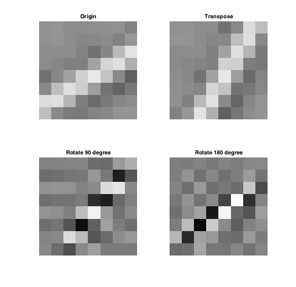

# 图像处理综合实验

* 无 36
* 李思涵
* 2013011187

## 原创性声明

此实验的代码 & 实验报告均为原创。


## 第一章 基础知识

### 1.1 了解图形工具箱

### 1.2 练习 Image file I/O 函数

在进行练习之前，我们先导入测试图像：

```matlab
load resource/hall
```

我们可以得到 `hall_color` 和 `hall_gray` 两个变量，其中测试图像是 `hall_color`。

#### 1.2a 画红圆

要画红圆，我们只需要先将测试图像复制一份，然后将圆圈内的点颜色全部置为 #FF0000 即可。代码如下： 

```matlab
%% add_circle: Add a red circle to the center of the given image
function circled_img = add_circle(img)
    circled_img = img;  % Copy the image.

    [y_max, x_max, ~] = size(circled_img);
    r = min(x_max, y_max) / 2;
    center = [(x_max + 1) / 2, (y_max + 1) / 2];

    for y = 1:y_max
        for x = 1:x_max
            if norm([x y] - center) <= r
                circled_img(y, x, :) = [255 0 0];
            end
        end
    end
```

调用函数并保存图像：

```matlab
imwrite(add_circle(hall_color), '../../report/hall_circal.bmp');
```

得到图像如下：


#### 1.2b 黑白格涂色

为了将测试图像涂成国际象棋“黑白格”的样子，我们只需要对所有像素进行迭代，并计算出每块像素所属的格子。若为黑格子，我们只需将该位置改为黑色即可。具体代码如下：

```matlab
%% add_chess_board_mask: Add a mask like a chess board to a image
function masked_img = add_chess_board_mask(img)
    masked_img = img;  % Copy the image.

    [y_max, x_max, ~] = size(img);

    for y = 1:y_max
        for x = 1:x_max
            if mod(ceil(x / x_max * 8) + ceil(y / y_max * 8), 2) == 0
                masked_img(y, x, :) = [0 0 0];
            end
        end
    end
```

调用函数并保存图像：

```matlab
imwrite(add_chess_borad_mask(hall_color), '../../report/hall_chess_borad.bmp');
```

得到图像如下：


可以看到，以上两个图都达到了目标。

## 第二章 图像压缩编码

### 2.1 在变换域中实现预处理

由于变换域中的第一个分量便是直流分量，所以很明显这一步骤可以在变换域中进行。具体来说，由于 N = 8 时二维 DCT 变换的 DC 基底为 1/8，故只需要将 DC 分量减去 `128 / (1/8) = 1024` 即可。

需要注意的是，由于原矩阵元素类型为 `uint8`，故将其减去 128 前应将其转换成足够大的有符号数，例如 `int16`。

我们使用 `hall_gray` 的其中一块进行验证：


```matlab
block = hall_gray(41:48, 65:72);
c = dct2(block);
c(1) = c(1) - 1024;  % Decimate DC component.

norm(c - dct2(int16(block) - 128))  % Compare two methods.
% ans =
%
%    2.1047e-13
```

可以看到，两种方法得到的变换域矩阵几乎完全相同。产生的一些误差可能来自于计算中的舍入误差。

### 2.2 实现二维 DCT

由公式 `C = D * P * DT` 可知，进行二维 DCT 的关键在于构造 DCT 算子 D。为此我们先定义函数 `trans_mat`：

```matlab
%% trans_mat: Construct NxN DCT transform matrix
function D = trans_mat(N)
    D = sqrt(2 / N) * cos([0:N-1]' * [1:2:2*N-1] * pi / (2 * N));
    D(1, :) = sqrt(1 / N);
```

然后我们便可以轻松进行二维 DCT 变换了：

```matlab
%% my_dct2: My implementation of dct2
function B = my_dct2(A)
    % DCT transform matrix.
    [row, col] = size(A);
    B = trans_mat(row) * double(A) * trans_mat(col)';
```

和内置函数 `dct2` 进行比较：

```matlab
norm(my_dct2(block) - dct2(block))
% ans =
%
%    7.9534e-13
```

可以看到误差极小，说明我们实现的二维 DCT 变换是正确的。

### 2.3 改变 DCT 系数

我们先来看一下 8x8 DCT 的基底：


可以发现，相对于前四列，右侧四列基底在横向上都有较高频变化。故若将右四列置为 0，恢复出的图像应在横向上没有高频分量。反之，若将左四列置为 0，则恢复出的图像在横向上应没有低频分量。

我们先对原来的 block 和 `hall_gray(17:24, 81:88)` 进行验证：

```matlab
c_right_zero = c;
c_left_zero = c;
c_right_zero(:, 5:8) = 0;
c_left_zero(:, 1:4) = 0;

subplot 311
imshow(block)
title Origin

subplot 312
imshow(uint8(idct2(c_right_zero) + 128))
title 'Zeros On The Right'

subplot 313
imshow(uint8(idct2(c_left_zero) + 128))
title 'Zeros On The Left'
```


可以看到，横向上的低频分量和高频分量被分离到了中下两幅图中，和我们的理论分析一致。

### 2.4 转置/旋转 DCT 系数

若对 DCT 系数转置，则横向与纵向分量系数互换，故恢复出的图像同样发生转置。

若将 DCT 系数旋转 90°，则大部分能量会转移到左下角，即纵向高频横向低频。

同样，若旋转 180°，则大部分能量会转移到右下角，即双向高频。

实际效果如下所示：

```matlab
subplot 221
imshow(uint8(idct2(c) + 128))
title Origin

subplot 222
imshow(uint8(idct2(c') + 128))
title Transpose

subplot 223
imshow(uint8(idct2(rot90(c)) + 128))
title 'Rotate 90 degree'

subplot 224
imshow(uint8(idct2(rot90(rot90(c))) + 128))
title 'Rotate 180 degree'
```



和我们的理论分析一致。令人不解的是，左下图与右上图，左上图与右下图看起来竟然有些许相似。让我们看看换另一块的看看处理结果：


仍然和我们的理论分析一致，但相似性几乎消失了。之前的相似性可能是由频谱的巧妙分布，导致旋转后仍会形成条带，所以看起来和原图有些相似。

## 第三章 信息隐藏

## 第四章 人脸识别
