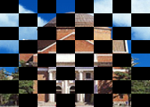

# 图像处理综合实验

* 无 36
* 李思涵
* 2013011187

## 原创性声明

此实验的代码 & 实验报告均为原创。


## 第一章 基础知识

### 1.1 了解图形工具箱

### 1.2 练习 Image file I/O 函数

在进行练习之前，我们先导入测试图像：

```matlab
load resource/hall
```

我们可以得到 `hall_color` 和 `hall_gray` 两个变量，其中测试图像是 `hall_color`。

#### 1.2a 画红圆

要画红圆，我们只需要先将测试图像复制一份，然后将圆圈内的点颜色全部置为 #FF0000 即可。代码如下： 

```matlab
%% add_circle: Add a red circle to the center of the given image
function circled_img = add_circle(img)
    circled_img = img;  % Copy the image.

    [x_max, y_max, ~] = size(circled_img);
    r = min(x_max, y_max) / 2;
    center = [(x_max + 1) / 2, (y_max + 1) / 2];

    for k = 1:3
        for x = 1:x_max
            for y = 1:y_max
                if norm([x y] - center) <= r
                    circled_img(x, y, :) = [255 0 0];
                end
            end
        end
    end
```

调用函数并保存图像：

```matlab
imwrite(add_circle(hall_color), 'report/hall_circal.bmp');
```

得到图像如下：


#### 1.2b 黑白格涂色

为了将测试图像涂成国际象棋“黑白格”的样子，我们只需要对所有像素进行迭代，并计算出每块像素所属的格子。若为黑格子，我们只需将该位置改为黑色即可。具体代码如下：

```matlab
%% add_chess_board_mask: Add a mask like a chess board to a image
function masked_img = add_chess_board_mask(img)
    masked_img = img;  % Copy the image.

    [x_max, y_max, ~] = size(img);

    for x = 1:x_max
        for y = 1:y_max
            if mod(ceil(x / x_max * 8) + ceil(y / y_max * 8), 2) == 0
                masked_img(x, y, :) = [0 0 0];
            end
        end
    end
```

调用函数并保存图像：

```matlab
imwrite(add_chess_borad_mask(hall_color), 'report/hall_chess_borad.bmp');
```

得到图像如下：



可以看到，以上两个图都达到了目标。

## 第二章 图像压缩编码

## 第三章 信息隐藏

## 第四章 人脸识别
